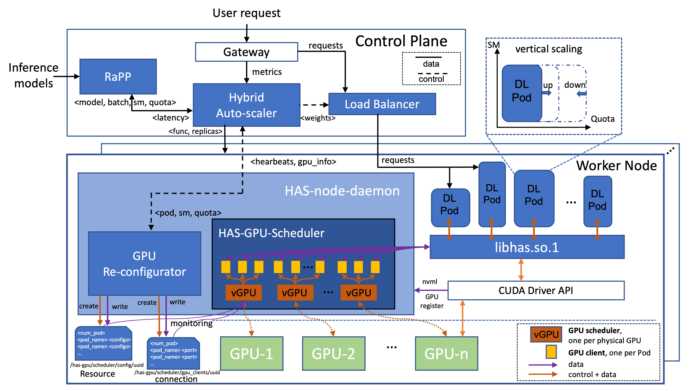

## HAS-GPU: Efficient Hybrid Auto-scaling with Fine-grained GPU Allocation for SLO-aware Serverless Inferences

**HAS-GPU** is an efficient Hybrid Auto-scaling Serverless architecture with fine-grained GPU allocation for deep learning inferences. HAS-GPU proposes an agile scheduler capable of allocating GPU Streaming Multiprocessor (SM) partitions and time quotas with arbitrary granularity and enables significant vertical quota scalability at runtime. To resolve performance uncertainty introduced by massive fine-grained resource configuration spaces, we propose the Resource-aware Performance Predictor (RaPP). Furthermore, we present an adaptive hybrid auto-scaling algorithm with both horizontal and vertical scaling to ensure inference SLOs and minimize GPU costs.

---
### Hardware and System Setup
- LRZ Compute Cloud VMs [(website)](https://doku.lrz.de/compute-cloud-10333232.html);
- NVIDIA Tesla V100 16 GB RAM; (10 VM nodes, each with 1 GPU);
- Ubuntu 20.04; (Only tested)
- NVIDIA Driver 535.54.03 , CUDA 12.2;
- Helm v3.17.0;
- Kubernetes 1.32.1;


## Getting Started Guide (for Artifact Evaluation)
The artifact consists of four components: (Part-1) direct deployment of HAS-GPU, (Part 2) deployment of other systems for comparison experiments, (Part 3) the RaPP module, and (Part 4) a full from-scratch build of the HAS-GPU's hybrid auto-scaler.

Part-1 includes all scripts and procedures required to deploy the complete HAS-GPU system. Please follow the instructions and specified software versions carefully when installing the Ubuntu operating system, setting up the Kubernetes (K8s) environment, configuring NVIDIA GPU infrastructure for cloud usage, and installing other required software and dependencies.

The RaPP module's deployment is already integrated in Part-1. However, for detailed operations/information such as training and inference of RaPP models, as well as dataset construction, please refer to the separate RaPP module repository linked in Part-3.

Part-2 provides the deployment configurations for two baseline systems used in the comparative experiments described in the paper. This part is fully independent of HAS-GPU.

Part 4 describes how to build the HAS-GPU auto-scaler from scratch. This step is optional and may be skipped.

All experiments were conducted on the Compute Cloud GPU cluster at LRZ (The Leibniz Supercomputing Centre). Due to the complexity of the HAS-GPU system, please feel free to contact us via email if needed. We can provide access to a smaller testing cluster and further support to facilitate system validation and help resolve potential issues.


## Step-by-Step Instructions

### Part-1: HAS-GPU Deployment

#### 1. Prepare K8s Infrastructure Environment & Dependencies

Before running any tests, you need to install the required Python packages:

1. Install client requirements:
   ```
   $ cd validation/client
   $ pip install -r requirements.txt
   $ cd ../../
   ```

2. Install model requirements:
   ```
   $ cd validation
   $ bash model_download.sh
   $ cd ../
   ```

3. Prepare other prerequisites, like k8s cluster, cloud environment for NVIDIA GPUs, etc:

   Follow the instructions in [k8s_infrastructure](./validation/k8s_infrastructure/README.md) to create the Kubernetes cluster infrastructure and configure the cloud environment for NVIDIA GPUs.

#### 2. Deploy FaSTPod system that HAS-GPU System relies on

Clone the fast-gshare repository:
```
$ cd validation
$ ./clone_fast_gshare.sh
$ ./install_fast_gshare.sh ./FaST-GShare
$ cd ../
```

#### 3. Deploy HAS-GPU System

If you would like to collect GPU usage data, you can run the following script:

```
$ mkdir /data/gpu_usage
$ sudo chmod 777 /data/gpu_usage
```

If you prefer to use our test scripts, you may skip this part and directly turn to step 4. Otherwise, run the following script to deploy the HAS-GPU System:
```
$ make has_deploy
```

- If you would like to build and push your image, refer to the [Part-4 Build HAS-GPU from Scratch](#part-4-build-has-gpu-from-scratch-optional) section (Optional).

#### 4. Run Experiment Workload

Run tests with HAS:
```
$ cd validation/HAS
$ python3 has-run-test.py --output-filename <output_name> --pod-prefix <pod_name> --yaml <path_to_yaml> --namespace <namespace> --url <gateway_ip_and_port> --mode <model_mode> --requests-file <path_to_requests_file>
```

Example:
```
$ python3 has-run-test.py --output-filename test-run-resnet-1 --pod-prefix resnet --yaml yaml/resnet.yaml --namespace fast-gshare-fn --url {gateway_ip}:{gateway_port} --mode image --requests-file ../client/rps.json --model-name resnet50
```

> Note: The test script automatically handles:
> - Deploying the the application and start to send requests with requests-file
> - Running the tests
> - Cleaning up resources after tests complete
>
> Gateway URL format: http://<gateway_ip>:<gateway_port>/function/<model_name>/predict, where the gatewayport is by default 8080.

---
### Part-2: Other systems for experimental comparison: KServe, FaST-GShare. (Optional)

#### 1. KServe (Deploy based on new K8s environment starting from Part-1's step 1)

1. Install KServe and its dependencies:
    ```
    $ ./validation/install-kserve.sh
    ```

    Note: You may need to manually run shell commands in this script. Refer to the [KServe](https://github.com/kserve/kserve) repository for more information.

   This script will install:
   - Knative Serving components
   - Istio as the network layer
   - Cert Manager
   - KServe components

2. Verify the installation:
    ```
    $ kubectl get pods -n knative-serving
    $ kubectl get pods -n kserve
    ```

3. Run tests with KServe:
    ```
    $ cd ./validation/kserve
    $ python3 kserve-run-test.py --output-filename <output_name> --pod-prefix <pod_name> --yaml <path_to_yaml> --namespace <namespace> --url <service_url> --mode <model_mode> --requests-file <path_to_requests_file>
    ```
    
    Example:
    ```
    $ python3 kserve-run-test.py --output-filename test-run-1 --pod-prefix resnet --yaml yaml/resnet.yaml --namespace default --url {gateway_url}:8080 --mode image --requests-file ../client/rps.json
    ```
    
    > Note: 
    > For tests with kserve, it is recommanded to use at least 2 GPU in the system. It's very likely to have a lot of violation with a single GPU in the cluster.

#### 2. FaST-GShare

1. Clone the FaST-GShare repository (if not already done):
    ```
    $ cd ./validation
    $ ./clone_fast_gshare.sh
    $ ./install_fast_gshare.sh ./FaST-GShare
    $ cd ../
    $ make fastgshare_deploy
    ```

2. Run tests with FaST-GShare default scaler:
    ```
    $ cd ./validation/fast-gshare
    $ python3 fast-gshare-run-test.py --output-filename <output_name> --pod-prefix <pod_name> --yaml <path_to_yaml> --namespace <namespace> --url <gateway_ip_and_port> --mode <model_mode> --requests-file <path_to_requests_file> --model-name <model_name>
    ```
    
    Example:
    ```
    $ python3 fast-gshare-run-test.py --output-filename test-run-1 --pod-prefix resnet-predictor --yaml yaml/resnet.yaml --namespace fast-gshare-fn --url {gateway_ip}:{gateway_port} --mode image --requests-file ../client/rps.json --model-name resnet50
    ```
    
    > Note: The test script automatically handles:
    > - Deploying the application and start to send requests with requests-file
    > - Running the tests
    > - Cleaning up resources after tests complete
    > - Output the GPU usage and requests result to csv files 
    > 
    > **Important**: You need to create the namespace first:
    > ```
    > $ kubectl create namespace fast-gshare-fn
    > ```

---
### Part-3: RaPP (Resource-aware Performance Prediction)

For detailed information on the RaPP model, including inference, training, dataset construction, and experimental results and data, please refer to the project repository: [RaPP: Resource-aware Performance Prediction](https://github.com/KontonGu/RaPP).

---
### Part-4: Build HAS-GPU from Scratch (Optional)

- Build HAS-GPU

    ```
    $ make docker-build docker-push IMG=<some-registry>/has-function-autoscaler:tag
    ```
    ex.
    ```
    $ make docker-build docker-push IMG=docker.io/kontonpuku666/has-function-autoscaler:test
    ```
    build and update the container in K8S environment
    ```
    make docker-clean docker-build docker-push IMG=docker.io/kontonpuku666/has-function-autoscaler:test
    ```

- Build FaST-GShare

    Refer to the [FaST-GShare](https://github.com/KontonGu/FaST-GShare) repository for more information.

- Build FaST-Manager
    Refer to the [FaST-Manager](https://github.com/KontonGu/FaST-Manager) repository for more information.

### Uninstall

Depending on which variant you installed, you can use the appropriate uninstallation method:

1. Uninstall HAS:
    ```
    $ kubectl delete -f {path_to_yaml} # Remove the HAS Function
    $ make has_undeploy  # Uninstall the controller from the cluster
    ```

2. Uninstall fast-gshare:
    ```
    $ ./validation/uninstall_fast_gshare.sh ./FaST-GShare
    ```

3. Uninstall KServe:
    ```
    $ ./validation/uninstall_kserve.sh
    ```

## Experiment Results
The results from our experiments can be found in the `validation/result/` directory. This directory contains the following subdirectories:

- `HAS/`: Contains results from experiments using our HAS-GPU implementation
- `fast-gshare/`: Contains results from experiments using the FaST-GShare default scaler
- `kserve/`: Contains results from experiments using the standard KServe implementation (with 2 GPUs)

Our tests include stress workloads for the following models: BERT, MobileNet_V3, ResNet50, ShuffleNet_V2, and ConvNeXt.

Each result directory contains:
- CSV files with detailed performance metrics
- Log files documenting the experiment execution
- Resource usage statistics in dedicated CSV files

The naming convention for result files follows the pattern: `[test-number]-[model]-[test-type].[extension]`


## License
Copyright 2024 HAS-GPU Authors, KontonGu (**Jianfeng Gu**, email: jianfeng.gu@tum.de), et. al.
@Techinical University of Munich, **CAPS Cloud Team**

Licensed under the Apache License, Version 2.0 (the "License");
you may not use this file except in compliance with the License.
You may obtain a copy of the License at

    http://www.apache.org/licenses/LICENSE-2.0

Unless required by applicable law or agreed to in writing, software
distributed under the License is distributed on an "AS IS" BASIS,
WITHOUT WARRANTIES OR CONDITIONS OF ANY KIND, either express or implied.
See the License for the specific language governing permissions and
limitations under the License.
